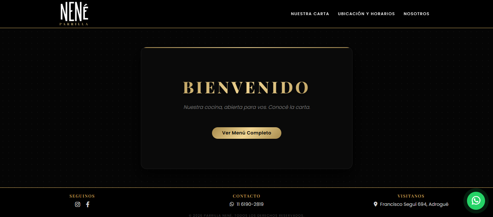
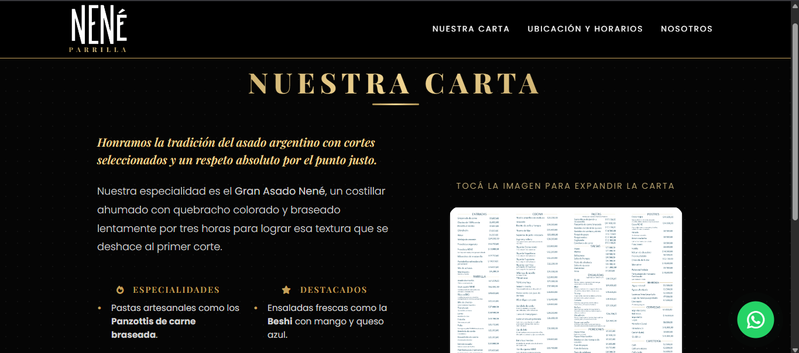
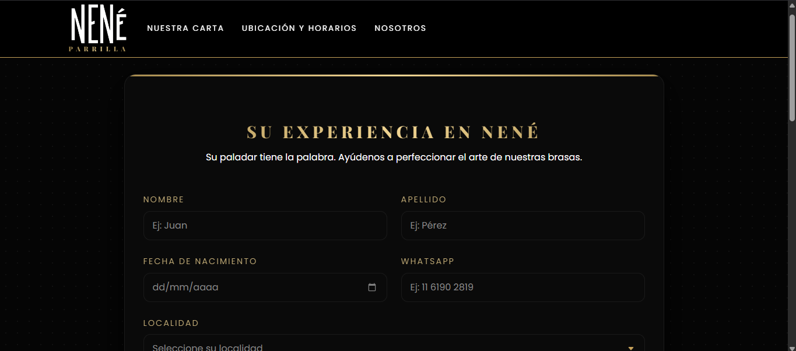
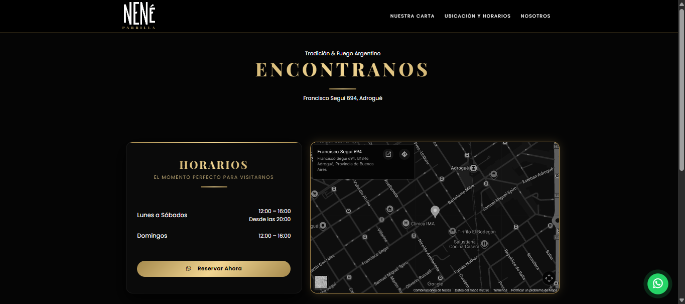
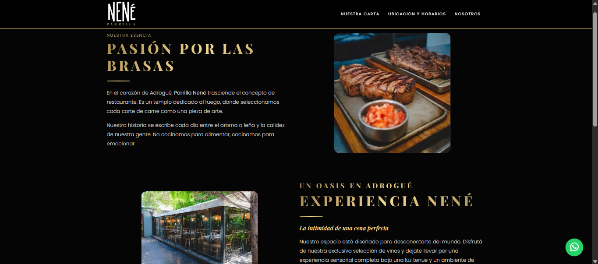

# Parrilla Nené - Plataforma Web

Bienvenido al repositorio oficial de la presencia digital de Parrilla Nené, un establecimiento gastronómico de prestigio ubicado en Adrogué, Buenos Aires. Esta plataforma combina una interfaz elegante para el comensal con un sistema dinámico de recolección de feedback mediante encuestas de satisfacción.

## Descripción del Proyecto
El sitio web tiene como objetivo centralizar la información del restaurante (Menú, Ubicación, Historia) y digitalizar la experiencia de post-venta. A través de un código QR brindado al pedir la cuenta, los clientes acceden a una encuesta exclusiva para evaluar la calidad del servicio, la comida y el ambiente. Una vez enviada la encuesta, los datos, la puntuación y el comentario crítico se redirigen a una hoja de cálculo de Google donde se aloja la información para llevar un control de incidencias y poder utilizar los datos para futuras estrategias de marketing.

---

## Visualización del Proyecto

### Galería de Interfaz
|  |  |  |  |  |

---

## Estructura de Carpetas
El proyecto sigue una arquitectura de desarrollo frontend clásica y organizada:

```plaintext
parrilla-nene/
├── docs/               # Documentación y archivos PDF (Carta descargable)
├── css/                # Hojas de estilo personalizadas
│   └── style.css       # Estilos principales (Variables, Dark Mode, Responsive)
├── js/                 # Lógica del lado del cliente
│   └── script.js       # Validación de formularios, Lightbox y Google Apps Script
├── img/                # Recursos visuales de la aplicación (Logos, Galería, Menú)
├── index.html          # Landing page (Bienvenida)
├── carta.html          # Visualizador de menú y especialidades
├── ubicacion_horarios.html # Mapa interactivo y horarios de atención
├── nosotros.html       # Historia y propuesta de valor
└── encuesta.html       # Formulario de satisfacción (Acceso vía QR)

Tecnologías Utilizadas
HTML5 & CSS3: Estructura semántica y diseño basado en variables CSS para una fácil mantenibilidad.

Bootstrap 5.3: Framework de diseño para garantizar un comportamiento 100% responsivo en diferentes dispositivos.

JavaScript (ES6+): Lógica interactiva y manejo de seguridad por tokens de tiempo.

SweetAlert2: Utilizado para notificaciones estéticas y personalizadas en el formulario de satisfacción.

Google Apps Script: Backend para el procesamiento de datos de la encuesta y almacenamiento en Google Sheets mediante modo no-cors.

Canvas Confetti: Efectos visuales para mejorar la experiencia de usuario tras completar el formulario.

Secciones Principales
1. Landing Page (Experiencia de Bienvenida)
Diseñada con un enfoque minimalista y tipografía Playfair Display para transmitir exclusividad. Incluye una llamada a la acción clara para explorar la carta del establecimiento.

2. Menú Interactivo e Inteligente
Visualización: Sistema de Lightbox personalizado que permite realizar zoom sobre la carta física digitalizada para una lectura cómoda.

Omnicanalidad: Botones directos para descargas en PDF, reservas vía WhatsApp e integración con plataformas de delivery como Rappi y PedidosYa.

3. Sistema de Ubicación y Espacio
Implementación de Google Maps con un filtro de inversión de colores (Grayscale/Invert) mediante CSS para integrarse cromáticamente con el estilo oscuro del sitio. Incluye una galería de imágenes del salón y el sector de parrilla.

4. Nosotros & Eventos
Sección dedicada a la identidad de marca, detallando la propuesta de valor del restaurante. Clasifica los servicios en Eventos Sociales, Corporativos y Catas Privadas para diversificar el modelo de negocio.

5. Módulo de Encuesta de Satisfacción (QR-Restricted)
Acceso Controlado: Validación mediante URLSearchParams que restringe el acceso solo a clientes que posean el token específico del código QR brindado en el local.

Validaciones: Control estricto de edad mínima (+16 años), formato de teléfono y validación de campos obligatorios.

Prevención de Duplicados: Uso de sessionStorage para evitar que un mismo usuario envíe múltiples encuestas en una misma sesión de navegación.

Seguridad y Rendimiento
Protección de Datos: Se genera un token dinámico basado en factores de tiempo (btoa) para validar las peticiones enviadas al servidor. Como hoja de ruta para el desarrollo futuro, se planea migrar las claves de API y la validación del QR a un entorno de backend dedicado.

Optimización: Uso de formatos de imagen .webp y carga diferida (loading="lazy") para asegurar una velocidad de carga óptima en dispositivos móviles.

Accesibilidad: Contraste de colores optimizado en tonos oro sobre negro para facilitar la lectura en condiciones de baja luminosidad (típicas de un restaurante).